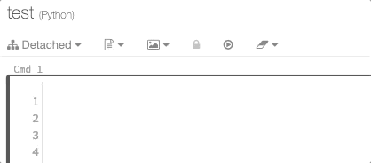

# Databricks Notebook Enhancer

Just a little hack to enhance the editor functionality of Databricks notebook.

<kbd>
  
</kbd>

## Installation
1. Clone this repository
2. Open `chrome://extensions` on Chrome
3. Enable "Developer mode"
4. Click "Load unpacked"
5. Select the folder that was just cloned

## Usage
The extension will be enabled automatically when you open a Databricks notebook.

## Test
1. Open a Databricks notebook
2. Select a cell and enter the edit mode
3. Type `df.gb`
4. Press `Tab` (`gb` will be expanded to `groupBy()`)
5. Press `Ctrl-u` (The current line will be duplicated below)
6. Press `jj` (A blank line will be inserted below)

## How it works
Each cell on the notebook has an object called `CodeMirror` which contains functions to get and edit the cell content. This extension injects a JS script to override some properties of `CodeMirror` and add features not provided by default.

[CodeMirror: User Manual](https://codemirror.net/doc/manual.html)

## Shortcuts
**Note that some default shortcuts in Chrome are overriden.**

|Shortcut|Action|
|:-|:-|
|`Ctrl-k`|Delete the word the cursor is on|
|`Ctrl-o`|Open a blank line below|
|`Shift-Ctrl-o`|Open a blank line above|
|`Ctrl-l`|Delete up to the end of the current line|
|`Ctrl-h`|Delete up to the start of the current line|
|`Ctrl-u`|Duplicate the current line below|
|`Shift-Ctrl-u`|Duplicate the current line above|

## Snippets (Press `Tab` to expand)
|Prefix|Snippet|
|:-|:-|
|`sl`|`select()`|
|`al`|`alias()`|
|`dt`|`distinct()`|
|`gb`|`groupBy()`|
|`pb`|`partitionBy()`|
|`ps`|`printSchema()`|
|`fl`|`filter()`|
|`srt`|`spark.read.table()`|
|`srp`|`spark.read.parquet()`|
|`fft`|`from pyspark.sql import functions as f, types as t`|
|`cnt`|`count()`|
|`rn`|`round()`|
|`fna`|`fillna()`|
|`dcnt`|`distinctCount()`|
|`btw`|`between()`|
|`wc`|`withColumn()`|
|`wcr`|`withColumnRenamed()`|
|`dp`|`display()`|
|`jn`|`join()`|
|`tpd`|`toPandas()`|

## JJ Keys
This feature is like mapping `jj` to `Esc` in Vim. Typing these keys fast in a row triggers the action.

|Keys|Action|
|:-|:-|
|`jj`|Open a blank like below|
|`jk`|Go to the end of the current line|
|`kk`|Delete the word the cursor is on|

## References
- [Is there a way to use Vim keybindings in Google Colaboratory?](https://stackoverflow.com/questions/48674326/is-there-a-way-to-use-vim-keybindings-in-google-colaboratory)
